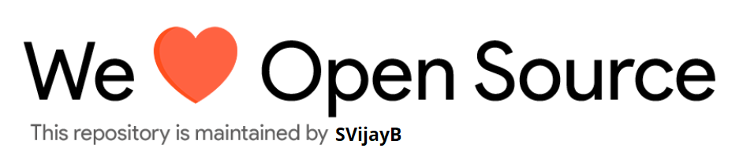

# Repo-Template

<p align="center">
    <picture>
        <source media="(prefers-color-scheme: dark)" srcset="assets/logo-dark.png">
        
    </picture>
    <br>Short description of the project
</p>

---

<p align="center">
    <a href="https://github.com/SVijayB/Repo-Template/pulls">
        
    </a>
<a href="https://github.com/SVijayB/Repo-Template/issues">
    
    </a>
<a href="https://github.com/SVijayB/Repo-Template/graphs/contributors">
    
    </a>
<a href="https://github.com/SVijayB/Repo-Template/blob/master/LICENSE">
    
    </a>
<a href="https://github.com/SVijayB/Repo-Template">
    
    </a>
<a href="https://github.com/SVijayB/Repo-Template/blob/master/.github/CODE_OF_CONDUCT.md">
    
    </a>
<a href="https://github.com/SVijayB/Repo-Template/blob/master/.github/CONTRIBUTING.md">
    
    </a>
</p

## 🗺️ Map

- [<code>📖 Motivation</code>](#-motivation)
- [<code>📦 Installation</code>](#-installation)
- [<code>🚀 Usage</code>](#-usage)
- [<code>🎯 Features</code>](#-features)
- [<code>🤝 Contributing</code>](#-contributing)
- [<code>📝 License</code>](#-license)

## 📖 Motivation


$$\color{#90D5FF}Purpose$$

*In order to easily create a new project, I have created a standard template for all my projects.*

$$\color{#90D5FF}Features \space \color{#56565E}Included$$

- ✅ Issue templates
- ✅ Pull request templates
- ✅ Contributing guidelines
- ✅ Code of conduct
- ✅ Required resources to help people start contributing
- ✅ README.md file with a basic setup

$$\color{#90D5FF}Quick \space \color{#56565E}Start$$

Simply search and replace `Repo-Template` with the name of your project.

*Or, use the automation script:*

```bash
python assets/template-script.py
```

## 📦 Installation

$$\color{#90D5FF}Stable \space \color{#56565E}Release$$

For the latest stable version, head to [Releases](https://github.com/SVijayB/Repo-Template/releases).

*Download and extract the source code.*

$$\color{#90D5FF}Clone \space \color{#56565E}Repository$$

```bash
git clone https://github.com/SVijayB/Repo-Template
```

$$\color{#90D5FF}Setup \space \color{#56565E}Environment$$

*Create a virtual environment:*

```bash
python3 -m venv venv
```

*Enter the virtual environment and install dependencies:*

```bash
pip install -r requirements.txt
```

## 🚀 Usage

$$\color{#90D5FF}Launch \space \color{#56565E}Application$$

*To launch the application, use:*

```bash
python3 app.py
```

$$\color{#90D5FF}Project \space \color{#56565E}Demo$$


You can also find the demo video [here](https://www.youtube.com/watch?v=dQw4w9WgXcQ).

## 🎯 Features

$$\color{#90D5FF}Template \space \color{#56565E}Components$$

- 📋 **Issue Templates** - Pre-configured templates for bug reports and feature requests
- 🔀 **Pull Request Templates** - Standardized PR format for consistency
- 📖 **Contributing Guidelines** - Clear instructions for contributors
- 🤝 **Code of Conduct** - Community standards and expectations
- 📚 **Documentation** - Comprehensive README and supporting docs
- 🔧 **Automation Script** - Quick setup for new projects

## 🤝 Contributing

$$\color{#90D5FF}How \space \color{#56565E}to \space Contribute$$

*To contribute to Repo-Template, fork the repository, create a new branch and send us a pull request.*

Make sure you read [CONTRIBUTING.md](https://github.com/SVijayB/Repo-Template/blob/master/.github/CONTRIBUTING.md) before sending us Pull requests.

Thanks for contributing to Open-source! ❤️

## 📝 License

This project is licensed under the MIT License - see the [LICENSE](https://github.com/SVijayB/Repo-Template/blob/master/LICENSE) file for details.

---

<p>
    
</p>
